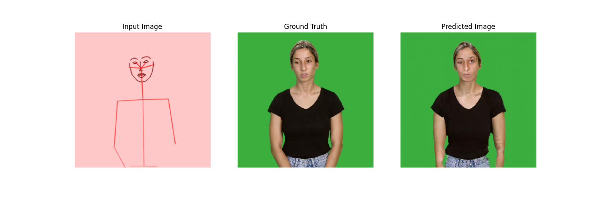

# Everybody Sign Now

This repository aims to train an in-browser real-time image translation model from pose estimation to videos.

The model code is a port of [Tensorflow's pix2pix tutorial](https://www.tensorflow.org/tutorials/generative/pix2pix).

## Data

We have recorded high resolution green screen videos of:
1. Maayan Gazuli (`Maayan_1`, `Maayan_2`) - Israeli Sign Language Interpreter
2. Amit Moryossef (`Amit`) - Project author

These videos are open for anyone to use for the purpose of sign language video generation.

This repository does not support additional input except for images.
By default, every image of Maayan is inferenced with a red background (255, 200, 200), 
and every image of Amit is inferenced with a blue background (200, 200, 255).

#### Data processing

- The videos were recorded in ProRes and were convereted to mp4 using `ffmpeg`.
- Then, using Final Cut Pro X, removed the green screen using the keying effect, and exported for "desktop".
- Finally, the FCPX export was processed again by `ffmpeg` to reduce its size (3.5GB -> 250MB).
```bash
ffmpeg -i CAM3_output.mp4 -qscale 0 CAM3_norm.mp4
```

### Download

Download the data from [here](https://nlp.biu.ac.il/~amit/datasets/GreenScreen/).

Or use the command line:
```bash
wget --no-clobber --convert-links --random-wait -r -p --level 3 -E -e robots=off --adjust-extension -U mozilla "https://nlp.biu.ac.il/~amit/datasets/GreenScreen/"
```

### Temporary File Storage

```

cd /home/nlp/amit/WWW/datasets/GreenScreen/mp4/Amit && gdown --folder --continue --id 1X1GuGMPHm4Sty9hr7Goxbbig5KpBE7p1
cd /home/nlp/amit/WWW/datasets/GreenScreen/mp4/Maayan_1 && gdown --folder --continue --id 1X4-LagvS2JWm9xyOg5t2QAvP1nDxt3Vr
cd /home/nlp/amit/WWW/datasets/GreenScreen/mp4/Maayan_2 && gdown --folder --continue --id 1XBz8NrRomAU506q7xYZUWkXEw_yVz5YD
```

## Training

Run `python -m everybody_sign_now.train`

Training is currently performed on CPU, roughly 5 minutes / 1000 steps.

This will train for a long while, and log each epoch result in a `progress` directory.
Once satisfied with the result, the script can be killed.



### Next Steps!

- Add `LSTM` to the `pix2pix` state, to introduce temporal coherence with very little additional compute
- Add another upsampler, from `256x256` to `512x512`
- Add face specific descriminator
- Add hand specific descriminator
- Mostly position body in fixed position

## Converting to `tfjs`

Run `./convert_to_tfjs.sh`

This will create a `web_model` directory with the model in tfjs, quantized to `float16`.